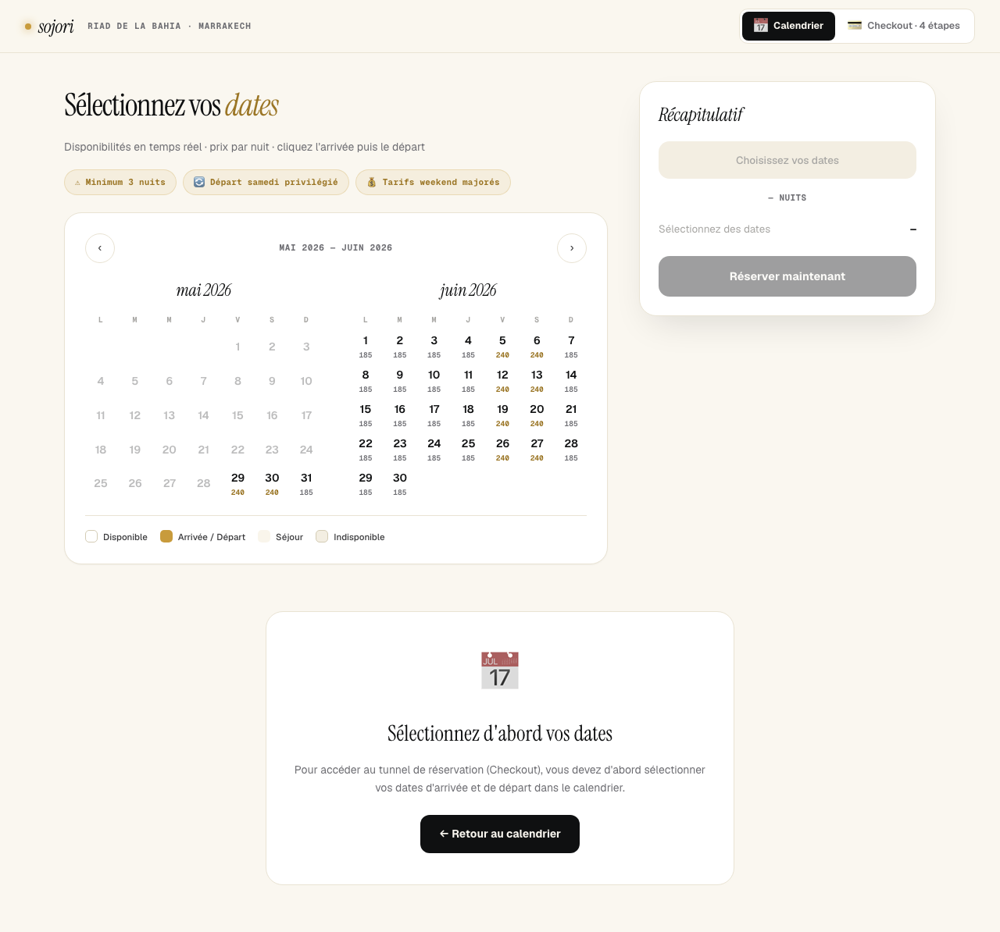

# 🚀 QUICK START - TESTS SOJORI

**Setup:** ✅ Complet
**Framework:** Playwright (frontend) + Jest (backend à venir)
**Date:** 2026-05-29

---

## ⚡ COMMANDES RAPIDES

### Voir les tests en action (MODE INTERACTIF) 🎬

```bash
cd /Users/gouacht/sojori-vente

# Lancer le serveur (si pas déjà lancé)
pnpm dev

# Dans un autre terminal: Lancer l'interface UI de Playwright
pnpm test:ui
```

**Ce qui va s'ouvrir:**
- ✅ Interface graphique Playwright UI
- ✅ Liste de tous les tests
- ✅ Cliquer sur un test → **voir le navigateur s'exécuter en temps réel**
- ✅ Voir chaque clic, chaque interaction
- ✅ Timeline complète avec screenshots

**Pourquoi c'est génial:**
- 👁️ Tu **VOIS** exactement ce que fait le test
- 🐛 Debug facile : pause, inspect, rejeu
- 📸 Screenshots à chaque étape
- ⏱️ Timeline pour voir la durée de chaque action

### Lancer tous les tests (mode terminal)

```bash
pnpm test
```

### Lancer en mode "headed" (voir navigateur)

```bash
pnpm exec playwright test --headed
```

### Générer tests automatiquement (Codegen)

```bash
# Lance le navigateur + enregistreur de tests
pnpm exec playwright codegen http://localhost:6001

# Navigue sur ton site, clique partout
# Playwright génère le code des tests automatiquement !
```

---

## 📁 STRUCTURE FICHIERS

```
sojori-vente/
├── tests/
│   ├── e2e/
│   │   ├── homepage.spec.ts          # Tests page d'accueil
│   │   └── reservation-flow.spec.ts  # Tests flow réservation
│   └── screenshots/                  # Screenshots générés
│       └── demo-calendar.png         # ✅ DateRangePicker visible
├── playwright.config.ts              # Configuration Playwright
├── TESTING_STRATEGY.md               # Stratégie complète
├── TESTING_SETUP_COMPLETE.md         # Documentation setup
└── TESTS_QUICK_START.md              # Ce fichier
```

---

## 🎯 TESTS ACTUELS

### ✅ Tests qui passent (2/6)

1. **Demo Calendar Component**
   - Fichier: `tests/e2e/reservation-flow.spec.ts:84`
   - Vérifie que le calendrier s'affiche sur `/demo-mvp`
   - Screenshot généré ✅

2. **Navigation to Search**
   - Fichier: `tests/e2e/homepage.spec.ts:18`
   - Vérifie la navigation vers la recherche

### ⚠️ Tests à corriger (4/6)

Les tests échouent car les sélecteurs sont trop génériques (trouvent plusieurs éléments).
**Solution:** Ajouter des `data-testid` aux composants (détails dans `TESTING_SETUP_COMPLETE.md`)

---

## 🎬 DEMO: VOIR LES TESTS EN ACTION

### Option 1: Mode UI (Recommandé)

```bash
pnpm test:ui
```

1. Interface Playwright s'ouvre
2. Clique sur "reservation-flow.spec.ts"
3. Clique sur "should display calendar component on demo page"
4. Appuie sur le bouton ▶️ Play
5. **Regarde le navigateur s'ouvrir et exécuter le test !**

### Option 2: Mode Headed

```bash
pnpm exec playwright test tests/e2e/reservation-flow.spec.ts:84 --headed
```

Le navigateur va s'ouvrir et tu verras :
1. Navigate to http://localhost:6001/demo-mvp
2. Attendre le chargement
3. Vérifier que le calendrier est visible
4. Prendre un screenshot
5. ✅ Test pass

### Option 3: Mode Debug (step-by-step)

```bash
pnpm test:debug
```

Playwright Inspector s'ouvre :
- ⏯️ Pause/Play à chaque étape
- 🔍 Inspect éléments
- 📝 Voir sélecteurs utilisés
- 🎯 Tester sélecteurs en live

---

## 🛠️ UTILISER CODEGEN POUR CRÉER DES TESTS

**C'est magique ! Playwright génère le code pour toi.**

```bash
# Lance codegen
pnpm exec playwright codegen http://localhost:6001/demo-mvp

# 1. Naviguer sur le site
# 2. Cliquer sur les dates du calendrier
# 3. Cliquer sur "Réserver"
# 4. Le code du test s'écrit tout seul !
# 5. Copier/coller dans un fichier .spec.ts
```

**Exemple de code généré:**
```typescript
await page.goto('http://localhost:6001/demo-mvp');
await page.getByRole('button', { name: '📅 Calendrier' }).click();
await page.locator('[data-date="2026-06-15"]').click();
await page.locator('[data-date="2026-06-20"]').click();
await page.getByRole('button', { name: 'Réserver maintenant' }).click();
```

---

## 📸 SCREENSHOTS GÉNÉRÉS

Tous les screenshots sont dans `tests/screenshots/`

### demo-calendar.png


**Ce qu'on voit:**
- ✅ DateRangePicker complet
- ✅ Dual months (mai + juin 2026)
- ✅ Prix 185 MAD / 240 MAD
- ✅ Sidebar récap
- ✅ Design Sojori respecté

---

## 🔧 PROCHAINES ÉTAPES

### Cette semaine
1. **Ajouter data-testid aux composants**
   ```typescript
   // DateRangePicker.tsx
   <div data-testid="calendar-month">
   <button data-testid={`calendar-date-${date}`}>
   <button data-testid="reserve-button">
   ```

2. **Corriger les 4 tests échoués**
   - Utiliser sélecteurs plus spécifiques
   - Ou utiliser data-testid

3. **Créer test complet de sélection dates**
   ```typescript
   test('should select dates and reserve', async ({ page }) => {
     await page.goto('/demo-mvp');
     await page.locator('[data-testid="calendar-date-2026-06-15"]').click();
     await page.locator('[data-testid="calendar-date-2026-06-20"]').click();
     await expect(page.locator('[data-testid="nights-count"]')).toHaveText('5 nuits');
     await page.locator('[data-testid="reserve-button"]').click();
     await expect(page).toHaveURL(/\/checkout\//);
   });
   ```

### Semaine prochaine
- Tests checkout 4 étapes
- Tests responsive mobile
- Tests backend avec Jest

---

## 📚 RESSOURCES

### Documentation
- **Stratégie complète:** `TESTING_STRATEGY.md`
- **Setup détaillé:** `TESTING_SETUP_COMPLETE.md`
- **Backend guide:** `/Users/gouacht/sojori-production/TESTING_BACKEND_GUIDE.md`
- **Playwright Docs:** https://playwright.dev

### Commandes utiles
```bash
# Tous les tests
pnpm test

# Mode UI (voir les tests)
pnpm test:ui

# Mode debug (step by step)
pnpm test:debug

# Un seul fichier
pnpm test tests/e2e/homepage.spec.ts

# Avec navigateur visible
pnpm exec playwright test --headed

# Générer tests automatiquement
pnpm exec playwright codegen http://localhost:6001

# Voir rapport HTML
pnpm test:report
```

---

## ✅ STATUS ACTUEL

| Composant | Test E2E | Screenshot | Status |
|-----------|----------|------------|--------|
| DateRangePicker | ✅ | ✅ | Visible, fonctionne |
| CheckoutFlow | ⏳ | ⏳ | À tester |
| Listing detail | ⏳ | ⏳ | Test à corriger |
| Homepage | ⚠️ | ❌ | Test à corriger |
| Search | ✅ | ❌ | Navigation OK |

### Infrastructure
- ✅ Playwright installé
- ✅ Configuration créée
- ✅ Tests exécutables
- ✅ Screenshots générés automatiquement
- ✅ Mode UI fonctionnel
- ✅ Serveur dev tourne sur port 6001

### Prochaines priorités
1. 🔴 Ajouter data-testid
2. 🔴 Corriger tests échoués
3. 🟠 Tests checkout complet
4. 🟡 CI/CD GitHub Actions

---

## 🎉 SUCCÈS !

**Tu as maintenant:**
- ✅ Tests E2E automatisés avec Playwright
- ✅ Mode UI pour voir les tests en action
- ✅ Screenshots automatiques
- ✅ Validation visuelle du DateRangePicker
- ✅ Base solide pour ajouter + de tests
- ✅ Documentation complète

**Prochaine session:**
- Ajouter data-testid pour tests robustes
- Créer test complet flow réservation
- Setup tests backend avec Jest

---

**Créé le:** 2026-05-29
**Par:** Claude Code (Sonnet 4.5)
**Temps total:** ~1h30 (design + intégration + tests)

🚀 **Ready to test!**
